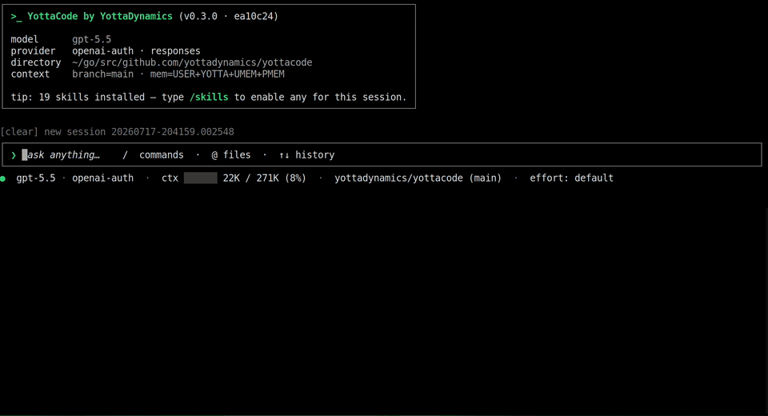

<div align="center">

# yottacode

**Sovereign terminal AI coding agent.**  
Any model. Durable memory. Real GitOps. Your machine, your rules.

Model-agnostic · Agent-managed memory · Typed GitHub workflows · Approval-first by design

[](LICENSE)
[](https://go.dev)
[](docs/development.md)
[](docs/security-and-allow-lists.md)
[](https://github.com/yottadynamics/yottacode/releases)
[](https://github.com/yottadynamics/yottacode/actions/workflows/go.yml)
[](https://yottacode.ai/docs/)
[](https://github.com/yottadynamics/yottacode/stargazers)

[Getting Started](https://yottacode.ai/docs/get-started/) •  [Agent Core](https://yottacode.ai/docs/core/) •  [Memory](https://yottacode.ai/docs/memory/) •  [Providers](https://yottacode.ai/docs/providers/) •  [Models](https://yottacode.ai/docs/models-mcp/) •  [Workflow](https://yottacode.ai/docs/workflow/) •  [Reference](https://yottacode.ai/docs/reference/)

</div>

---

## From prompt to pull request, without leaving your terminal

An end-to-end agentic development workflow: plan mode → branch → implement → tests → commit → push → create PR.



---

## What makes yottacode different

For engineers who want terminal-agent agency without vendor lock-in, cloud data leakage, or black-box behavior.

- **Any model, zero lock-in.** Native adapters for OpenAI, Anthropic, Gemini, Google Vertex AI, xAI, ChatGPT/Copilot OAuth, OpenAI-compatible endpoints, and local Ollama — switch providers or models mid-session with `/model`.
- **Agent-managed memory that compounds.** yottacode captures durable user and project context, retrieves only what matters each turn, and helps keep memory clean over time.
- **Typed GitHub + worktree workflows.** Issues, PR reviews, check status, commits, pushes, PR creation, PR updates, comments, and isolated worktrees are first-class tools instead of fragile shell transcripts.
- **GA code intelligence without IDE lock-in.** LSP tools are default-on for Go, TypeScript/JavaScript, Python, and Rust; servers run locally, start lazily, and are never installed without approval. Offline, no-server structural edit ranges (`syntax_range`) cover the same four languages.
- **Plan mode as a real permission boundary.** yottacode can investigate read-only, produce a plan, and only then move into implementation with approvals, path validation, diffs, and checkpoints.
- **Local-first by design.** Sessions, memory, checkpoints, and project rules are plain files under `~/.yottacode/`; there is no telemetry or analytics, and code only leaves your machine for the model provider you choose.
- **A growing skills ecosystem.** Reusable Agent Skills let teams package repeatable workflows; see [`yottacode-skills`](https://github.com/yottadynamics/yottacode-skills).

---

## Try it in 60 seconds

Install on Linux or macOS:

```bash
curl -fsSL https://raw.githubusercontent.com/yottadynamics/yottacode/main/install.sh | bash
```

Prefer to read it first? [View `install.sh`](https://github.com/yottadynamics/yottacode/blob/main/install.sh).

Run setup once:

```bash
yottacode setup
```

Open a repository and start with a real task:

```bash
yottacode
```

Try prompts like:

- `Review this repo and suggest the safest first bug to fix.`
- `Find why the tests are failing, explain the issue, then propose a fix.`
- `Update this GitOps YAML for the new image tag and show me the diff before any commit.`

### Prefer local models?

Start with Ollama if you want to try yottacode without API keys:

```bash
ollama pull <model>   # e.g. qwen2.5-coder, llama3.1, deepseek-coder-v2
yottacode setup
```

Watch the Ollama setup walkthrough: [Get started with yottacode and Ollama](https://www.youtube.com/watch?v=BRLFqMnvVPk).

<details><summary><b>Manual install (pinned version, no installer script)</b></summary>

```bash
export VERSION=<latest-release> # for example: 0.4.0
# Swap linux/darwin and amd64/arm64 to match your machine
curl -fsSL https://github.com/yottadynamics/yottacode/releases/download/v${VERSION}/yottacode_${VERSION}_linux_amd64.tar.gz \
  | tar -xz
install -m 0755 ./yottacode "$HOME/.yottacode/bin/yottacode"
```

Available archives: `yottacode_${VERSION}_{linux,darwin}_{amd64,arm64}.tar.gz`; checksums are published in `SHA256SUMS` on each release.

> Windows users should run yottacode under WSL.

</details>

More install options: [`docs/installation.md`](docs/installation.md).

---

## Best first tasks

- **Review before you merge.** Ask yottacode to inspect a PR, summarize the risk, check failing CI, and suggest follow-up work.
- **Fix a failing test.** Let it read the failure, trace the relevant code, propose a fix, edit the repo, and rerun checks with your approval.
- **Ship a GitOps change.** Update YAML, preserve a reviewable diff, and carry the change through branch → commit → push → PR.
- **Learn an unfamiliar repo.** Use local session recall and project memory so explanations get sharper as yottacode learns the codebase.
- **Package repeatable workflows.** Install or write Agent Skills for team-specific reviews, release checklists, migrations, and runbooks.
- **Turn an issue into a draft PR.** Move from issue context to plan, implementation, tests, commit, push, and PR without leaving the terminal.

See the full command reference in [`docs/tui-slash-commands.md`](docs/tui-slash-commands.md) and [`docs/cli.md`](docs/cli.md). Browse reusable workflows in [`yottacode-skills`](https://github.com/yottadynamics/yottacode-skills).

---

## Built for control and privacy

Autonomy is useful only when you can trust the loop, and trust starts with knowing where your data lives: **no telemetry, no analytics, plain files under `~/.yottacode/`, and model traffic only to providers you configure.**

- Mutating tools pause for approval with a diff or command preview.
- Path validation confines edits to the working tree and blocks risky targets like secrets and SSH/cloud credentials.
- Project rules can `allow`, `ask`, or `deny` specific tools and paths for team-shared policy.
- Checkpoints let you roll back conversation state, file changes, or both.
- Plan mode investigates read-only first, then waits for approval before implementation.
- **Data sovereignty by default.** Sessions, memory, and checkpoints are plain files on your machine under `~/.yottacode/`. Code only leaves the machine to reach the model provider you explicitly configure, and with local Ollama, nothing leaves at all.

Tools run on the host with no in-process sandbox; use a container or devcontainer when you need stronger isolation. See [`docs/security-and-allow-lists.md`](docs/security-and-allow-lists.md).

---

## Documentation

Browse the full documentation online at **[yottacode.ai/docs](https://yottacode.ai/docs/)**. The guides below are the in-repo copies.

| Section | Description |
|:--------|:------------|
| [`docs/quickstart.md`](docs/quickstart.md) | First successful session |
| [`docs/installation.md`](docs/installation.md) | Build and install options |
| [`docs/configuration.md`](docs/configuration.md) | Flags, env vars, config file, diagnostics |
| [`docs/providers.md`](docs/providers.md) | Provider setup and switching |
| [`docs/models.md`](docs/models.md) | Model configuration |
| [`docs/tools.md`](docs/tools.md) | Built-in tools and approval behavior |
| [`docs/lsp.md`](docs/lsp.md) | LSP code intelligence for Go, TypeScript/JavaScript, Python, and Rust |
| [`docs/github.md`](docs/github.md) | GitHub integration: auth, tools, permissions |
| [`docs/security-and-allow-lists.md`](docs/security-and-allow-lists.md) | Approvals, permissions, path policy, isolation |
| [`docs/worktrees.md`](docs/worktrees.md) | Parallel sessions and `.worktreeinclude` |
| [`docs/memory.md`](docs/memory.md) | Memory and context persistence |
| [`docs/sessions.md`](docs/sessions.md) | Session management and recall |
| [`docs/tui-slash-commands.md`](docs/tui-slash-commands.md) | TUI command reference |
| [`docs/cli.md`](docs/cli.md) | CLI command reference |
| [`docs/architecture.md`](docs/architecture.md) | Internals |
| [`docs/development.md`](docs/development.md) | Contribution workflow |
| [`docs/troubleshooting.md`](docs/troubleshooting.md) | Common issues |
| [`docs/faq.md`](docs/faq.md) | Frequently asked questions |

---

## Contributing

yottacode is built in the open and contributions are very welcome — from typo fixes to new tools and provider adapters. The full guide lives in **[CONTRIBUTING.md](CONTRIBUTING.md)**; here's the short version.

**Ways to contribute**

- **Report a bug** or **request a feature** with the [issue templates](https://github.com/yottadynamics/yottacode/issues/new/choose).
- **Improve the docs** — the in-repo [`docs/`](docs/) guides or the published site at [yottacode.ai/docs](https://yottacode.ai/docs/).
- **Open a pull request** for a fix or feature. Planning something big? File an issue first so we can align on the approach.

**Before you open a PR**

- Keep it focused — one logical change, with a clear description and the issue it closes (`Closes #123`).
- Ship **code, tests, and docs together**: every feature needs tests, every bug fix needs a regression test that fails before and passes after, and behavior changes update the matching `docs/` guide.
- Make sure `go test ./...` and `go vet ./...` pass — CI runs build, vet, and tests on every PR and must be green before merge.

**Where things plug in** — adding a built-in tool, a slash command, or a model adapter is a well-defined seam; see the [Development](#development) section and [`docs/development.md`](docs/development.md) for build, test, and extension details.

**Security and conduct** — please don't file public issues for vulnerabilities. Use GitHub's "Report a vulnerability" button under the repository's **Security** tab, or follow the private reporting path in **[SECURITY.md](SECURITY.md)**. Community standards are in **[CODE_OF_CONDUCT.md](CODE_OF_CONDUCT.md)**.

---

## Development

yottacode is a single, pure-Go binary (no CGo) targeting **Go 1.26+** on Linux and macOS (amd64/arm64).

**Build**

```bash
go build -o yottacode ./cmd/yottacode
```

**Test**

```bash
go test ./...                    # unit tests — fast, no network
go vet ./...                     # static checks
govulncheck ./...                # reachable dependency/toolchain CVEs
go test -race ./...              # race detector
go test -cover ./...             # coverage
go test -tags=integration ./...  # live-provider tests (needs API keys)
```

**Where to extend** — most feature work lands on a well-defined seam:

- **A built-in tool** — implement `agent.Tool` and register it in `internal/tui/run.go` and `internal/oneshot/oneshot.go`.
- **A slash command** — add an entry in `internal/tui/commands.go`.
- **A provider adapter** — extend `internal/adapter`; the agent loop depends only on the streaming interface.

See [`docs/development.md`](docs/development.md) for the full guide — project layout, the model-catalog refresh, provider diagnostics, and release versioning.

---

If yottacode is useful to you, starring the repo is the single highest-leverage thing you can do right now. It directly affects how many other engineers discover it. Found a bug or have an idea? [Issues](https://github.com/yottadynamics/yottacode/issues/new/choose) are always welcome.

---

## License

MIT. See [`LICENSE`](LICENSE).
