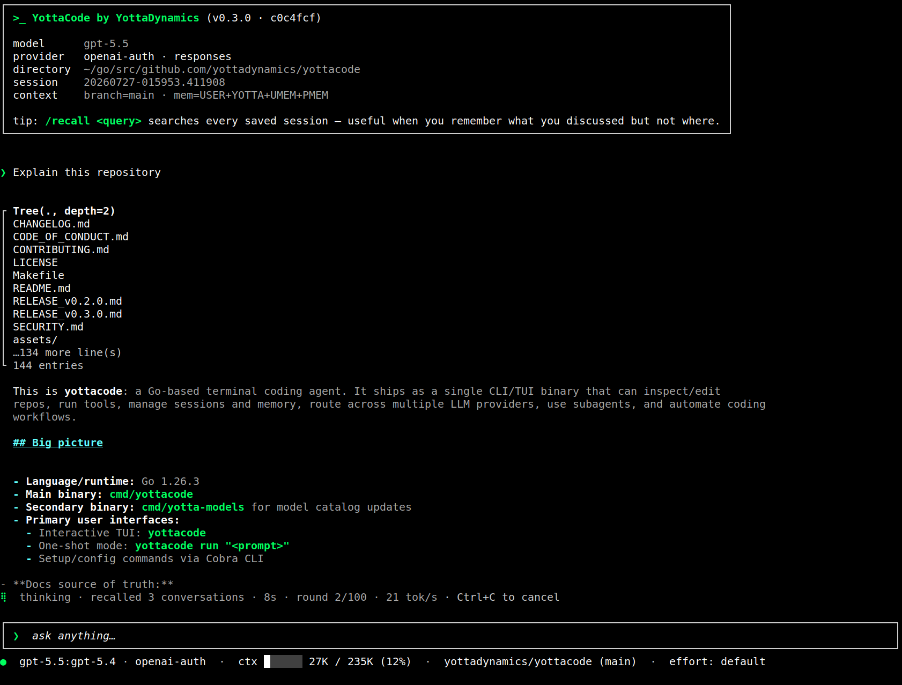

<div align="center">

# yottacode

**An autonomous, self-learning AI coding agent that handles complex, multi-step development tasks — directly from your terminal, with the model of your choice.**

[](LICENSE)
[](https://go.dev)
[](https://github.com/yottadynamics/yottacode/releases)
[](https://github.com/yottadynamics/yottacode/actions/workflows/go.yml)
[](https://yottacode.ai/docs/)

[Getting Started](https://yottacode.ai/docs/get-started/) •  [Agent Core](https://yottacode.ai/docs/core/) •  [Memory](https://yottacode.ai/docs/memory/) •  [Providers](https://yottacode.ai/docs/providers/) •  [Models](https://yottacode.ai/docs/models-mcp/) •  [Workflow](https://yottacode.ai/docs/workflow/) •  [Reference](https://yottacode.ai/docs/reference/)




</div>

---

`yottacode` is an autonomous, self-learning coding agent. Give it a goal in plain language and it plans the work, reads and edits real repositories, runs commands and tests, drives git, and iterates until the task is done — all from your terminal. It's model-agnostic by design: bring your own provider and swap models mid-session without changing how you work. As it goes, a self-learning memory layer captures what it discovers about you and your codebase and surfaces the most relevant pieces back into every turn, so it gets sharper the more you use it — while a built-in security policy of layered approvals and path validation gates every edit and shell command, keeping that autonomy under your control. Around the core loop you get an interactive terminal UI, a scriptable one-shot mode for automation, durable sessions, and cross-session recall.

> **Status:** pre-1.0 (`v0.3.0`). The CLI, configuration, and on-disk formats are stabilizing. Pin a tag if you depend on yottacode from scripts.

---

## Quick Start

**One-liner install** (Linux + macOS):

```bash
curl -fsSL https://raw.githubusercontent.com/yottadynamics/yottacode/main/install.sh | bash
```

Then launch the interactive setup wizard:

```bash
yottacode setup
```

> Windows users should run yottacode under WSL.

<details><summary><b>Manual install (pinned version, no installer script)</b></summary>

```bash
export VERSION=0.3.0
# Swap linux/darwin and amd64/arm64 to match your machine
curl -fsSL https://github.com/yottadynamics/yottacode/releases/download/v${VERSION}/yottacode_${VERSION}_linux_amd64.tar.gz \
  | tar -xz
install -m 0755 ./yottacode "$HOME/.yottacode/bin/yottacode"
```

Available archives: `yottacode_${VERSION}_{linux,darwin}_{amd64,arm64}.tar.gz`; checksums in `SHA256SUMS` on each release.

</details>

For build-from-source, cross-compilation, manual provider configuration, and other install paths, see [`docs/installation.md`](docs/installation.md).

---

## Why yottacode

- **Memory that learns you.** Memory is plain text and grep-able: you own `USER.md`, and the agent curates everything else through `memory_save` / `memory_forget` (project writes to `YOTTACODE.md` are approval-gated). A per-turn retrieval engine surfaces only what's relevant, so yottacode gets sharper about you and your codebase the more you use it. See [`docs/memory.md`](docs/memory.md).

- **Use any model, switch any time.** Native adapters for **OpenAI**, **Anthropic**, **Google Gemini**, **xAI** (Grok), **local Ollama** (no API key), and **ChatGPT OAuth**, plus a generic OpenAI-compatible adapter for **NVIDIA NIM**, **Groq**, **vLLM**, **Llama Stack**, or any custom `/v1` gateway. Swap provider or model mid-session with `/provider use` and `/model` — no lock-in, and no hidden default that silently bills you.

- **A built-in security policy.** A first-launch trust prompt scopes each workspace, mutating tools pause for approval with a syntax-highlighted diff, and project rules support `allow` / `ask` / `deny` (deny wins) for team-shared pre-approvals. Write-path validation confines edits to the working tree, blocks symlink writes, and firewalls secret-bearing paths (`.env`, `~/.ssh`, cloud credentials) from both reads and writes. Tools run on the host with no in-process sandbox — containerize for stronger isolation. See [`docs/security-and-allow-lists.md`](docs/security-and-allow-lists.md).

- **Deep GitHub integration.** A typed `go-github` adapter (no shelling out to the `gh` CLI) gives the agent first-class pull-request and issue tools — read and review PRs, open and update them, post review comments, and triage issues — plus slash commands like `/git-create-pr`, `/git-review-pr`, and `/git-implement-issue`, which takes an issue end-to-end: research → plan → branch → implement → tests → commit → push → draft PR. See [`docs/github.md`](docs/github.md).

- **A deep, repo-aware tool surface.** Built-in tools span reads, writes, search, a full git suite (status / diff / blame / log / commit / checkpoint / rollback / file-at-revision), bash, tests, local media editing with `ffmpeg`/`ffprobe`, the `todo_write` working-plan tracker, and the plan-mode tools — each with an explicit approval policy. See [`docs/tools.md`](docs/tools.md) and [`docs/marketing-videos.md`](docs/marketing-videos.md).

- **Plan first, then let it run.** Plan mode (`/plan`, `Shift+Tab`, or `--permission-mode plan`) investigates read-only and drafts a plan you approve; approving drops into auto mode so implementation skips per-tool prompts, while `run_bash`, `git_commit`, `git_checkpoint`, and `rollback` stay in the safety floor. `Shift+Tab` cycles **normal → auto → plan** mid-turn, and the agent can never escalate its own permissions.

- **Delegate to typed subagents.** Hand research, code search, planning, and verification to subagents that run in their own context window, so the parent only sees the final answer. Four ship built-in — `Explore`, `Plan`, `general-purpose`, and `verification` — and you can add your own under `.yottacode/agents/`.

- **Reusable skills, loaded on demand.** 17 built-in skill playbooks (SSH/remote ops, git investigation, TDD, security audit, code review, performance profiling, and more) load only when relevant, and you can install your own from a path, URL, or GitHub shorthand. Skills stay off until you enable them each session, following the [agentskills.io spec](https://agentskills.io/specification).

- **Undo any step.** Every message is auto-checkpointed with the conversation and the pre-edit contents of the files about to change, so `/checkpoints` (or a double-tap of `Esc`) rolls back conversation, files, or both — with a configurable 30-day TTL.

- **Never lose a session.** Per-turn atomic saves survive crashed terminals, `/recall` runs local full-text search across every saved session, and `/summarize` compacts long histories after snapshotting the original transcript.

- **Work in parallel.** `yottacode --worktree <name>` runs a session in its own git worktree so two agents can edit the same repo without colliding, and a per-repo `.worktreeinclude` copies gitignored configs into each one. See [`docs/worktrees.md`](docs/worktrees.md).

- **Make it your own.** Add `/your-command` by dropping a markdown file into `~/.yottacode/commands/` or `.yottacode/commands/`, with `$ARGUMENTS` substitution, optional frontmatter, and `@<path>` file references.

- **Built for the terminal.** Inline rendering keeps your scrollback intact, with markdown-rendered output, a Tab-completing slash palette, multi-line input, image paste, and a `?` cheatsheet. Run it interactively, or script the same core in one-shot mode — `yottacode run "…"` puts the answer on `stdout` and reasoning on `stderr` — all from a single static Go binary.

---

## Commands

Type `/` in the TUI to open the command palette — it filters as you type and supports Tab completion.

| Command | Description |
|:--------|:------------|
| `/help` | List all commands with help text |
| `/clear` | Start a fresh session (the current one is saved) |
| `/sessions [id\|name]` | Open the sessions menu, or resume a session directly |
| `/recall <query>` | Full-text search across every saved session |
| `/summarize` | Compress session history into a structured summary |
| `/checkpoints` | Restore conversation and/or files to a prior prompt (also `Esc` `Esc`) |
| `/redo` | Edit and re-run the most recent message |
| `/usage` | Per-session token usage, today's rollup, and estimated cost |
| `/context` | Show the context-window usage breakdown |
| `/model [name]` | Open the model picker, or switch the active model |
| `/provider` | Select or inspect a provider (`list`, `use`, `add`, `remove`, `models`) |
| `/effort [level]` | Set reasoning effort where supported (`default` · `low` · `medium` · `high`) |
| `/doctor` | Probe provider auth and model access |
| `/memory` | Open the memory picker (`/memory search <q>` ranks saved memories) |
| `/system` | Show the active system prompt, including injected memory |
| `/init` | Draft `.yottacode/YOTTACODE.md` from the current repo |
| `/permissions` | Show where permissions are configured |
| `/max-iterations <N>` | Cap tool-call iterations per turn (default 100; auto mode 4×) |
| `/loop <interval> [Nx] <prompt>` | Repeat prompts or slash commands as local loops with IDs (`/loop 2m check current PR CI`, `/loop stop <id>`, 5-day expiry) |
| `/plan` | Toggle plan mode (`/plan list` resumes a saved plan; also `Shift+Tab`) |
| `/yolo` | Toggle yolo mode — every tool auto-runs, no safety floor, no iteration cap (also `--yolo` at startup; deny rules still win) |
| `/subagents` | Open the subagents picker — view, stop, or list agent types |
| `/skills` | Open the skills menu (`install`, `show`, `uninstall`, `check`, `update`) |
| `/git-commit` | Compose and run a one-line commit on the staged changes |
| `/git-create-pr [base]` | Open a pull request for the current branch |
| `/git-update-pr [ref]` | Refresh a PR's title and body to match the commit list |
| `/git-review-pr [ref]` | Self-review a PR: failing checks, blockers, suggestions, nits |
| `/git-push` | Push the current branch to origin (sets upstream on first push) |
| `/git-implement-issue <n>` | Implement a GitHub issue end-to-end: fetch → plan → branch → code → tests → commit → push → draft PR |
| `/mcp` | Manage MCP servers (`/mcp logs <name>` dumps recent stderr) |
| `/theme [name]` | Change the color theme (live preview; persists to config) |
| `/setup` | Re-run the setup wizard (reloads config on return) |
| `/quit` | Exit yottacode |

> Auto mode is intentionally not a slash command: enter auto mode with `Shift+Tab` (or `--permission-mode auto`). Yolo mode is the exception — it has a `/yolo` slash toggle in addition to `yottacode --yolo` at launch, so the danger overlay can be turned off mid-session without restarting.

Full references: [`docs/cli.md`](docs/cli.md) and [`docs/tui-slash-commands.md`](docs/tui-slash-commands.md).

---

## Documentation

Browse the full documentation online at **[yottacode.ai/docs](https://yottacode.ai/docs/)**. The guides below are the in-repo copies.

| Section | Description |
|:--------|:------------|
| [`docs/quickstart.md`](docs/quickstart.md) | First successful session |
| [`docs/installation.md`](docs/installation.md) | Build and install options |
| [`docs/configuration.md`](docs/configuration.md) | Flags, env vars, config file, diagnostics |
| [`docs/providers.md`](docs/providers.md) | Provider setup and switching |
| [`docs/models.md`](docs/models.md) | Model configuration |
| [`docs/tools.md`](docs/tools.md) | Built-in tools and approval behavior |
| [`docs/github.md`](docs/github.md) | GitHub integration: auth, tools, permissions |
| [`docs/security-and-allow-lists.md`](docs/security-and-allow-lists.md) | Approvals, permissions, path policy, isolation |
| [`docs/worktrees.md`](docs/worktrees.md) | Parallel sessions and `.worktreeinclude` |
| [`docs/memory.md`](docs/memory.md) | Memory and context persistence |
| [`docs/sessions.md`](docs/sessions.md) | Session management and recall |
| [`docs/tui-slash-commands.md`](docs/tui-slash-commands.md) | TUI command reference |
| [`docs/cli.md`](docs/cli.md) | CLI command reference |
| [`docs/architecture.md`](docs/architecture.md) | Internals |
| [`docs/development.md`](docs/development.md) | Contribution workflow |
| [`docs/troubleshooting.md`](docs/troubleshooting.md) | Common issues |
| [`docs/faq.md`](docs/faq.md) | Frequently asked questions |

---

## Contributing

yottacode is built in the open and contributions are very welcome — from typo fixes to new tools and provider adapters. The full guide lives in **[CONTRIBUTING.md](CONTRIBUTING.md)**; here's the short version.

**Ways to contribute**

- **Report a bug** or **request a feature** with the [issue templates](https://github.com/yottadynamics/yottacode/issues/new/choose).
- **Improve the docs** — the in-repo [`docs/`](docs/) guides or the published site at [yottacode.ai/docs](https://yottacode.ai/docs/).
- **Open a pull request** for a fix or feature. Planning something big? File an issue first so we can align on the approach.

**Before you open a PR**

- Keep it focused — one logical change, with a clear description and the issue it closes (`Closes #123`).
- Ship **code, tests, and docs together**: every feature needs tests, every bug fix needs a regression test that fails before and passes after, and behavior changes update the matching `docs/` guide.
- Make sure `go test ./...` and `go vet ./...` pass — CI runs build, vet, and tests on every PR and must be green before merge.

**Where things plug in** — adding a built-in tool, a slash command, or a model adapter is a well-defined seam; see the [Development](#development) section and [`docs/development.md`](docs/development.md) for build, test, and extension details.

**Security and conduct** — please don't file public issues for vulnerabilities. Use GitHub's "Report a vulnerability" button under the repository's **Security** tab, or follow the private reporting path in **[SECURITY.md](SECURITY.md)**. Community standards are in **[CODE_OF_CONDUCT.md](CODE_OF_CONDUCT.md)**.

---

## Development

yottacode is a single, pure-Go binary (no CGo) targeting **Go 1.26+** on Linux and macOS (amd64/arm64).

**Build**

```bash
go build -o yottacode ./cmd/yottacode
```

**Test**

```bash
go test ./...                    # unit tests — fast, no network
go vet ./...                     # static checks
go test -race ./...              # race detector
go test -cover ./...             # coverage
go test -tags=integration ./...  # live-provider tests (needs API keys)
```

**Where to extend** — most feature work lands on a well-defined seam:

- **A built-in tool** — implement `agent.Tool` and register it in `internal/tui/run.go` and `internal/oneshot/oneshot.go`.
- **A slash command** — add an entry in `internal/tui/commands.go`.
- **A provider adapter** — extend `internal/adapter`; the agent loop depends only on the streaming interface.

See [`docs/development.md`](docs/development.md) for the full guide — project layout, the model-catalog refresh, provider diagnostics, and release versioning.

---

## License

MIT. See [`LICENSE`](LICENSE).
