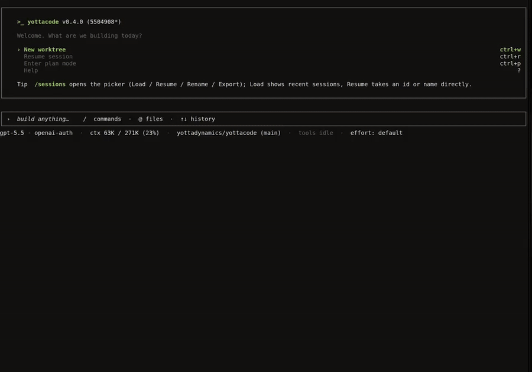

<div align="center">

# yottacode

**Sovereign AI coding agent for your terminal.**  
A local-first coding agent that turns issues into tested pull requests while you stay in control of every model, command, and file change.

Model-agnostic · Local-first · Approval-first · GitHub-ready

[](LICENSE)
[](https://go.dev)
[](https://github.com/yottadynamics/yottacode/releases)
[](https://github.com/yottadynamics/yottacode/actions/workflows/go.yml)
[](https://yottacode.ai/docs/)

[Getting started](https://yottacode.ai/docs/get-started/) • [Docs](https://yottacode.ai/docs/) • [Providers](docs/providers.md) • [Security](docs/security-and-allow-lists.md) • [GitHub](docs/github.md) • [Contributing](CONTRIBUTING.md)

<table width="92%" cellpadding="0" cellspacing="0">
  <tr>
    <td align="left" bgcolor="#161b22" height="30">
      &nbsp;&nbsp;<font color="#ff5f56">●</font>&nbsp;<font color="#ffbd2e">●</font>&nbsp;<font color="#27c93f">●</font>&nbsp;&nbsp;&nbsp;<sub><strong>yottacode</strong></sub>
    </td>
  </tr>
  <tr>
    <td bgcolor="#0d1117" align="center">
      
    </td>
  </tr>
</table>

</div>

---

## Try it in 60 seconds

Install on Linux or macOS:

```bash
curl -fsSL https://yottacode.ai/cli/install.sh | bash
```

Run setup once:

```bash
yottacode setup
```

Open a repository and try a read-only first task:

```bash
cd your-repo
yottacode
```

Then ask:

```text
Review this repo, identify one low-risk improvement, and show me a plan before editing.
```

<details><summary><b>Prefer local models?</b></summary>

Start with Ollama if you want to try yottacode without API keys:

```bash
ollama pull qwen2.5-coder   # or llama3.1 / deepseek-coder-v2
yottacode setup
```

Watch the Ollama setup walkthrough: [Get started with yottacode and Ollama](https://www.youtube.com/watch?v=BRLFqMnvVPk).

</details>

<details><summary><b>Prefer a hosted provider?</b></summary>

Configure a hosted model during setup, or set the matching environment variable before running yottacode:

```bash
export OPENAI_API_KEY=...
yottacode setup
```

See [`docs/providers.md`](docs/providers.md) for OpenAI, Anthropic, Gemini, Google Vertex AI, xAI, ChatGPT/Copilot OAuth, Ollama, and OpenAI-compatible provider setup.

</details>

<details><summary><b>Manual install: pinned version, no installer script</b></summary>

```bash
export VERSION=<latest-release> # for example: 0.4.0
# Swap linux/darwin and amd64/arm64 to match your machine
curl -fsSL https://github.com/yottadynamics/yottacode/releases/download/v${VERSION}/yottacode_${VERSION}_linux_amd64.tar.gz \
  | tar -xz
install -m 0755 ./yottacode "$HOME/.yottacode/bin/yottacode"
```

Available archives: `yottacode_${VERSION}_{linux,darwin}_{amd64,arm64}.tar.gz`; checksums are published in `SHA256SUMS` on each release.

> Windows users should run yottacode under WSL.

</details>

More install options: [`docs/installation.md`](docs/installation.md).

---

## Why yottacode?

| If you want... | yottacode gives you... |
|---|---|
| Model choice | OpenAI, Anthropic, Gemini, Google Vertex AI, xAI, ChatGPT/Copilot OAuth, Ollama, NVIDIA NIM-compatible workflows, vLLM, OpenRouter, Together, and other `/v1`-compatible endpoints |
| Local-first control | Plain-file sessions, memory, approvals, checkpoints, and no telemetry |
| Real repo workflows | Branches, commits, PRs, CI checks, reviews, issues, comments, and isolated worktrees |
| Team-safe automation | Permission rules, path validation, approval previews, plan mode, and rollback checkpoints |
| LSP code intelligence | Local LSP tools for Go, TypeScript/JavaScript, Python, and Rust |
| One-shot automation | `yottacode run` for CI/CD, ticket resolution, and scripted workflow automation |
| IDE integration | ACP protocol support so yottacode can connect to compatible IDEs and agent frontends |
| Repeatable team workflows | Agent Skills for review checklists, runbooks, releases, migrations, and project-specific playbooks |

---

## Built for control and privacy

Autonomy is useful only when you can trust the loop. yottacode is designed around explicit control: **no telemetry, no analytics, plain files under `~/.yottacode/`, and model traffic only to providers you configure.**

| Control | What it means |
|---|---|
| Approval-first mutations | File writes, shell commands, git operations, and other risky actions pause for approval with a diff, command, or write preview. |
| Path validation | Edits stay inside the working tree and block risky targets like secrets and SSH/cloud credentials. |
| Project permissions | Team rules can `allow`, `ask`, or `deny` specific tools and paths. |
| Plan mode | yottacode can investigate read-only first, produce a plan, and wait before implementation. |
| Checkpoints and rollback | Conversation and repo changes can be checkpointed and rolled back. |
| Local model option | Ollama keeps model traffic on your machine. |
| Plain-file memory | User and project memory live under `~/.yottacode/` and can be inspected or deleted. |

Tools run on the host by default. For stronger shell-command isolation, enable the optional Podman command sandbox with `[sandbox] backend = "podman"`; it runs approved `run_bash`/`run_tests` commands and document subprocess helpers in GHCR-published containers. See [`docs/sandbox.md`](docs/sandbox.md) and [`docs/security-and-allow-lists.md`](docs/security-and-allow-lists.md).

Provider costs depend on the model you choose. yottacode reports token usage where providers expose it; see [`docs/cost.md`](docs/cost.md) for current cost-tracking behavior.

---

## Use yottacode when your terminal session becomes the workflow

- **You are reviewing a PR and need more than a summary.** Ask yottacode to read the diff, inspect the touched code, check CI, identify risk, and draft the exact follow-up comment.
- **A test is failing and the fix is not obvious.** Let yottacode reproduce the failure, trace callers, patch the code, add a regression test, and rerun checks before you commit.
- **You need to make a safe infrastructure or GitOps change.** Update YAML, Helm values, Terraform, or deployment config with approval-gated diffs instead of copy-pasting snippets between chat and your editor.
- **You are jumping into a repo you do not know yet.** Use plan mode, LSP, file search, memory, and session recall to map the codebase before anything mutates.
- **You want an agent to carry the boring GitHub steps.** Turn an issue into a branch, commits, CI inspection, PR body, and reviewer-ready summary without leaving the TUI.
- **You need model choice without changing your workflow.** Start with local Ollama, use a cloud model when needed, and switch providers mid-session without moving the task to another tool.

Browse reusable workflows in [`yottacode-skills`](https://github.com/yottadynamics/yottacode-skills).

---

## Project status

yottacode is pre-1.0 and actively developed. The CLI, config, and on-disk formats are still stabilizing, but the core terminal workflow is usable today for real repositories.

Good first areas for contributors:

- Docs, examples, and first-run polish.
- Provider adapters and setup diagnostics.
- Workflow skills for real engineering tasks.
- Bug reports from real terminal sessions.
- Tests around approval, GitHub, memory, and worktree behavior.

---

## Support the project

If yottacode looks useful, a GitHub star helps the project reach more developers, attract contributors, and grow the ecosystem. Bug reports, setup feedback, and workflow ideas are just as valuable — [open an issue](https://github.com/yottadynamics/yottacode/issues/new/choose).

---

## Documentation

Browse the full documentation online at **[yottacode.ai/docs](https://yottacode.ai/docs/)**. The guides below are the in-repo copies.

| Section | Description |
|:--------|:------------|
| [`docs/quickstart.md`](docs/quickstart.md) | First successful session |
| [`docs/installation.md`](docs/installation.md) | Build and install options |
| [`docs/configuration.md`](docs/configuration.md) | Flags, env vars, config file, diagnostics |
| [`docs/providers.md`](docs/providers.md) | Provider setup and switching |
| [`docs/models.md`](docs/models.md) | Model configuration |
| [`docs/tools.md`](docs/tools.md) | Built-in tools and approval behavior |
| [`docs/lsp.md`](docs/lsp.md) | LSP code intelligence for Go, TypeScript/JavaScript, Python, and Rust |
| [`docs/github.md`](docs/github.md) | GitHub integration: auth, tools, permissions |
| [`docs/security-and-allow-lists.md`](docs/security-and-allow-lists.md) | Approvals, permissions, path policy, isolation |
| [`docs/worktrees.md`](docs/worktrees.md) | Parallel sessions and `.worktreeinclude` |
| [`docs/memory.md`](docs/memory.md) | Memory and context persistence |
| [`docs/sessions.md`](docs/sessions.md) | Session management and recall |
| [`docs/tui-slash-commands.md`](docs/tui-slash-commands.md) | TUI command reference |
| [`docs/cli.md`](docs/cli.md) | CLI command reference |
| [`docs/architecture.md`](docs/architecture.md) | Internals |
| [`docs/development.md`](docs/development.md) | Contribution workflow |
| [`docs/troubleshooting.md`](docs/troubleshooting.md) | Common issues |
| [`docs/faq.md`](docs/faq.md) | Frequently asked questions |

---

## Contributing

yottacode is built in the open, and contributions are welcome — from typo fixes and docs improvements to provider adapters, workflow skills, and core agent features.

Before opening a PR, please keep changes focused, include tests/docs for behavior changes, and make sure `go test ./...` and `go vet ./...` pass.

See **[CONTRIBUTING.md](CONTRIBUTING.md)** for the full guide. Please report vulnerabilities privately through **[SECURITY.md](SECURITY.md)**, not public issues.

---

## Development

yottacode is a single, pure-Go binary targeting **Go 1.26+** on Linux and macOS (amd64/arm64).

**Build**

```bash
go build -o yottacode ./cmd/yottacode
```

**Test**

```bash
go test ./...                    # unit tests — fast, no network
go vet ./...                     # static checks
govulncheck ./...                # reachable dependency/toolchain CVEs
go test -race ./...              # race detector
go test -cover ./...             # coverage
go test -tags=integration ./...  # live-provider tests, needs API keys
```

Most extension work lands in a documented seam: built-in tools, slash commands, provider adapters, MCP integration, skills, and TUI workflows. See [`docs/development.md`](docs/development.md) for the full guide — project layout, the model-catalog refresh, provider diagnostics, and release versioning.

---

## License

MIT. See [`LICENSE`](LICENSE).
