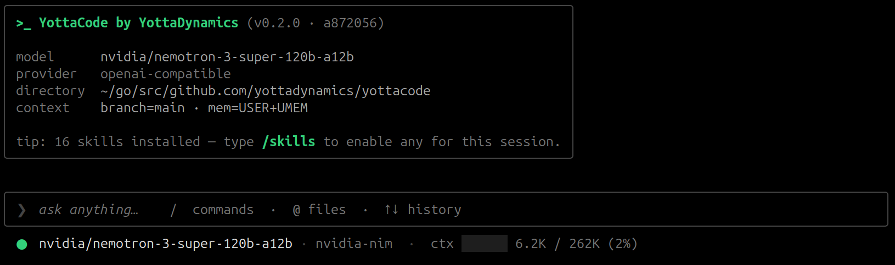

<div align="center">

# yottacode

**Open-source terminal coding agent for your day-to-day engineering work.**

A single Go binary. Multi-provider. Multi-session. Memory that persists.

[](LICENSE)
[](https://go.dev)
[](https://github.com/yottadynamics/yottacode/releases)
[](https://github.com/yottadynamics/yottacode/actions/workflows/go.yml)



</div>

---

`yottacode` gives you an interactive terminal UI for coding, a scriptable one-shot mode for automation, structured tools for inspecting and editing real repositories, durable sessions, cross-session recall, and explicit memory — all without tying your workflow to one model provider.

> **Status:** pre-1.0 (`v0.2.0`). The CLI, configuration, and on-disk formats are stabilizing. Pin a tag if you depend on yottacode from scripts.

---

## Table of Contents

- [Quick Start](#quick-start)
- [Features](#features)
- [Common Commands](#common-commands)
- [Documentation](#documentation)
- [Development](#development)
- [Contributing](#contributing)
- [License](#license)

---

## Quick Start

**One-liner install** (Linux + macOS, amd64 + arm64):

```bash
curl -fsSL https://raw.githubusercontent.com/yottadynamics/yottacode/main/install.sh | bash
```

Then launch the interactive setup wizard:

```bash
yottacode setup
```

The installer drops `yottacode` into `~/.yottacode/bin/` (no `sudo`), verifies the release archive against published SHA256 sums, and offers to add the directory to your shell `PATH` (creating a timestamped backup of the rc file before any edit). Pass `--no-modify-rc` to skip the rc edit, or `--yes` to accept it non-interactively.

After install, yottacode checks GitHub for a newer release once a day on startup (cached at `~/.yottacode/cache/update-check.json`) and offers to upgrade before the TUI starts. Set `YOTTACODE_NO_UPDATE_CHECK=1` to disable.

> Windows users should run yottacode under WSL.

<details><summary><b>Manual install (pinned version, no installer script)</b></summary>

```bash
export VERSION=0.2.0
# Swap linux/darwin and amd64/arm64 to match your machine
curl -fsSL https://github.com/yottadynamics/yottacode/releases/download/v${VERSION}/yottacode_${VERSION}_linux_amd64.tar.gz \
  | tar -xz
install -m 0755 ./yottacode "$HOME/.yottacode/bin/yottacode"
```

Available archives: `yottacode_${VERSION}_{linux,darwin}_{amd64,arm64}.tar.gz`; checksums in `SHA256SUMS` on each release.

</details>

For build-from-source, cross-compilation, manual provider configuration, and other install paths, see [`docs/installation.md`](docs/installation.md).

---

## Features

### Multi-Provider Support

Native adapters for **OpenAI**, **Anthropic**, **Google Gemini**, **xAI** (Grok), **local Ollama** (no API key needed), and **ChatGPT OAuth** ("Sign in with ChatGPT"). A generic OpenAI-compatible adapter covers **NVIDIA NIM**, **Groq**, **vLLM**, **Llama Stack**, and any custom `/v1` gateway.

Swap providers and models mid-session via `/provider use` and `/model`.

### Self-Learning Memory Layer

Memory is plain text, grep-able, and split across a handful of files. **You own `USER.md`** — anything you want yottacode to remember about you globally goes there. **Everything else is curated by the agent** through `memory_save` / `memory_forget` in-conversation, with approval-gated writes for `YOTTACODE.md`.

| Path | Scope | Maintained by |
|:-----|:------|:--------------|
| `~/.yottacode/USER.md` | User preferences | **You** — human-edited only |
| `~/.yottacode/memory/` | Global (cross-project) | Agent — auto-curated |
| `./.yottacode/YOTTACODE.md` | Project | You seed it (or run `/init`); agent edits go through the approval modal |
| `~/.yottacode/projects/<slug>/memory/` | Project | Agent — auto-curated |

### Built-in Security & Approval Layer

First-launch trust prompt on each new workspace records consent at `~/.yottacode/trusted-roots.json`; subfolders of a trusted root inherit trust automatically. Manage roots with `yottacode trust list/add/remove/clear`.

Mutating tools (writes, edits, shell, git mutations) ask before running, with a syntax-highlighted diff for edits. Project rules support `allow` / `ask` / `deny` (deny wins) for team-shared pre-approvals. Write-path validation confines writes to the working tree, blocks symlink writes, and firewalls secret-bearing paths (`.env`, `~/.ssh`, cloud credentials, auth stores) from both reads and writes.

> Tools run on the host — there is no in-process sandbox. For stronger isolation, run yottacode inside a container or devcontainer. See [`docs/security-and-allow-lists.md`](docs/security-and-allow-lists.md).

### Polished Terminal UX

Inline rendering keeps your scrollback intact. Markdown-rendered assistant output, slash-command palette with Tab completion, multi-line input via `Ctrl+J`, input history, image paste support (paste a screenshot path or `file:///` URL and the model sees it), and a `?` cheatsheet overlay.

### Repo-Aware Tool Surface

Thirty built-in tools spanning reads, writes, filesystem, search, git helpers (status / diff / blame / log / commit / checkpoints / rollback / file-at-revision), bash, tests, the `todo_write` working-plan tracker, and the `exit_plan_mode` plan-approval surface — each with explicit approval policy.

See [`docs/tools.md`](docs/tools.md) for the full list.

### Typed Subagents

Delegate research, code search, planning, and verification to typed subagents that run in their own context window — the parent only sees the final answer, never the child's tool calls or reasoning.

Four built-ins ship:

| Subagent | Purpose |
|:---------|:--------|
| **`Explore`** | Read-only code search |
| **`Plan`** | Drafts an implementation plan |
| **`general-purpose`** | Open-ended research |
| **`verification`** | Adversarial PASS/FAIL/PARTIAL verdict (background-by-default) |

Ship your own under `.yottacode/agents/<name>.md` (project) or `~/.yottacode/agents/<name>.md` (global) with YAML frontmatter declaring tools, an optional model override, and an optional `background: true` default. `/subagents` opens an inline picker; `Enter` views any task's transcript in `$PAGER`.

> Background subagents (`run_in_background:true` for fire-and-forget delegation) are an opt-in experimental feature. Enable with `yottacode --experimental background_subagents`, `YOTTACODE_EXPERIMENTAL=background_subagents`, or `[experimental]` in `~/.yottacode/config.toml`. Foreground delegation is default-on. See [`docs/experimental.md`](docs/experimental.md).

### Plan Mode + Auto Mode

**Plan mode** (`/plan`, `Shift+Tab`, or `--permission-mode plan`) toggles a read-only research mode: the agent investigates, asks clarifying questions, writes a plan file under `~/.yottacode/plans/<slug>.md`, then presents it in an approval card.

- **`[A]`** Approve — enter auto mode, skip per-tool prompts during implementation
- **`[M]`** Manual — plan mode exits, per-tool prompts continue as normal

**Auto mode** (`Shift+Tab` from normal, or `--permission-mode auto`) skips approval friction when you trust a multi-step implementation. `run_bash`, `git_commit`, `git_checkpoint`, and `rollback` remain in the safety floor and still prompt. `Shift+Tab` cycles: **normal** → **auto** → **plan** → **normal**.

> The permissions-bypass overlay (`--dangerously-skip-permissions`) is startup-only; there is no in-TUI toggle. See [`docs/tui-slash-commands.md`](docs/tui-slash-commands.md).

### Per-Prompt Checkpoints

Every user message gets an automatic checkpoint capturing the conversation plus the pre-edit contents of any files the agent is about to touch.

`/checkpoints` or double-tap `Esc` opens a picker over past prompts; pick one and choose to restore conversation, files, or both — the original prompt reappears in the input box so you can edit and resend. 30-day TTL by default, configurable in `config.toml`.

### Custom Slash Commands

Drop a markdown file into `~/.yottacode/commands/` (user scope) or `.yottacode/commands/` (project scope, committable) and it shows up as `/<name>` in the palette. Bodies support `$ARGUMENTS` / `$1`..`$9` argument substitution, optional YAML frontmatter (`description`, `argument-hint`), and `@<path>` file references. Subdirectories namespace commands as `/ns:name`.

### Agent Skills

Reusable capability playbooks the agent loads on demand. 16 built-in skills cover: SSH/remote ops, git investigation, Dockerfile review, TDD, verification, Playwright testing, `diagnose` debugging loop, security audit, plan writing & execution, brainstorming, code review, architecture review, prototyping, session handoff, and performance profiling.

Drop a directory into `~/.yottacode/skills/<slug>/` (user-scope) or `.yottacode/skills/<slug>/` (project-scope) — project shadows user shadows built-in. Format follows the [agentskills.io spec](https://agentskills.io/specification).

> Skills are **off by default each session** — the model sees no skill list until you open `/skills` and pick which ones to enable. Slash-form invocations (e.g. `/diagnose`) bypass the enablement gate because typing the slash IS the selection.

### Cross-Session Recall

`/recall <query>` runs local SQLite FTS5 search across every saved session. `/summarize` compacts long sessions after snapshotting the full pre-summary transcript. Per-turn atomic save means crashed terminals don't lose work.

### Scriptable One-Shot Mode

```bash
yottacode run "explain this repository"
```

`stdout` = answer, `stderr` = reasoning + tool status. Composes cleanly with pipes and CI logs.

### Parallel Sessions via Worktrees

`yottacode --worktree <name>` (or `-w <name>`) runs the session in a fresh git worktree at `~/.yottacode/worktrees/<repo-slug>/<name>/` on branch `worktree-<name>`. Two yottacode sessions can edit the same repo in parallel without colliding.

A per-repo `.worktreeinclude` file copies gitignored configs (`.env`, IDE settings) into each new worktree so the agent doesn't trip over missing setup. The agent can spin its own worktrees via the `enter_worktree` / `exit_worktree` tools. Manage via `yottacode worktree list / remove / prune / status`.

See [`docs/worktrees.md`](docs/worktrees.md).

---

## Common Commands

### In the TUI

| Command | Description |
|:--------|:------------|
| `/help` | Show the command list |
| `/quit` | Exit yottacode |
| `/clear` | Start a fresh session (current is saved) |
| `/permissions` | Show where permissions are configured |
| `/system` | Show the active system prompt |
| `/sessions` | Open the sessions menu (or `/sessions <id\|name>` to resume) |
| `/model` | Open the model picker (`list [all]`, `<name>`) |
| `/provider` | Open the provider menu (`list`, `use`, `add`, `remove`, `models`) |
| `/doctor` | Probe provider auth and model access |
| `/redo` | Edit and re-run the most recent message |
| `/recall <query>` | Full-text search across saved sessions |
| `/summarize` | Compress session history into a summary |
| `/memory` | Open the memory picker |
| `/max-iteration <N>` | Cap tool-call iterations per turn (default: 50) |
| `/setup` | Re-run the setup wizard |
| `/init` | Draft `.yottacode/YOTTACODE.md` from the current repo |
| `/plan` | Toggle plan mode (also `Shift+Tab`) |
| `/plan list` | Resume an earlier plan |

**Auto mode** and the **permissions-bypass overlay** are intentionally not slash commands:

- **Auto mode** — `Shift+Tab` from normal mode, or `yottacode --permission-mode auto`
- **Permissions bypass** — `yottacode --dangerously-skip-permissions` at launch only

### From the Shell

```bash
yottacode doctor                            # probe provider auth
yottacode provider list                     # list configured providers
yottacode provider use openai               # switch default provider
yottacode model list                        # list available models
yottacode sessions list                     # list saved sessions
yottacode sessions resume <id-or-name>      # resume a session
yottacode --continue                        # resume most recent session
yottacode memory list                       # list memory entries
yottacode run "explain this repository"     # one-shot mode
```

Full references: [`docs/cli.md`](docs/cli.md) and [`docs/tui-slash-commands.md`](docs/tui-slash-commands.md).

---

## Documentation

| Guide | Description |
|:------|:------------|
| [`docs/quickstart.md`](docs/quickstart.md) | First successful session |
| [`docs/installation.md`](docs/installation.md) | Build and install options |
| [`docs/configuration.md`](docs/configuration.md) | Flags, env vars, config file, diagnostics |
| [`docs/providers.md`](docs/providers.md) | Provider setup and switching |
| [`docs/models.md`](docs/models.md) | Model configuration |
| [`docs/tools.md`](docs/tools.md) | Built-in tools and approval behavior |
| [`docs/github.md`](docs/github.md) | GitHub integration: auth, tools, permissions |
| [`docs/security-and-allow-lists.md`](docs/security-and-allow-lists.md) | Approvals, permissions, path policy, isolation |
| [`docs/worktrees.md`](docs/worktrees.md) | Parallel sessions and `.worktreeinclude` |
| [`docs/memory.md`](docs/memory.md) | Memory and context persistence |
| [`docs/sessions.md`](docs/sessions.md) | Session management and recall |
| [`docs/tui-slash-commands.md`](docs/tui-slash-commands.md) | TUI command reference |
| [`docs/cli.md`](docs/cli.md) | CLI command reference |
| [`docs/architecture.md`](docs/architecture.md) | Internals |
| [`docs/development.md`](docs/development.md) | Contribution workflow |
| [`docs/troubleshooting.md`](docs/troubleshooting.md) | Common issues |
| [`docs/faq.md`](docs/faq.md) | Frequently asked questions |

---

## Development

```bash
go test ./...                    # unit tests
go test -tags=integration ./...  # live-provider integration tests
go test -race ./...              # race detector
go test -cover ./...             # coverage
```

See [`docs/development.md`](docs/development.md) for build, test, and adapter-extension guidance.

---

## Contributing

Issues and pull requests are welcome at [github.com/yottadynamics/yottacode](https://github.com/yottadynamics/yottacode). New capabilities should include tests and docs. Before opening a PR:

```bash
go test ./...
go vet ./...
```

---

## License

MIT. See [`LICENSE`](LICENSE).
