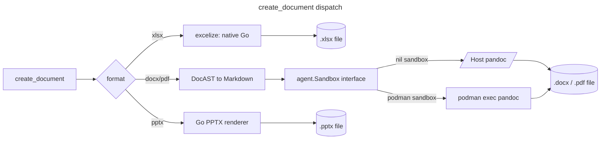

# Document generation

`create_document` generates a new `xlsx`, `docx`, `pdf`, or `pptx` file
from structured content — the write-side counterpart to
[`read_document`](tools.md#read_document), which now also reads `.pdf`,
`.xlsx`, `.docx`, and `.pptx` (alongside its original CSV/TSV/JSON/JSONL/
XML/HTML formats). xlsx and pptx generation are native Go paths; docx/pdf
generation and PDF parsing shell out to `pandoc`/`pdftotext`/`pdfinfo`.
Only those subprocess-backed paths route through the same command
[`Sandbox`][sandbox-doc] `run_bash` uses.

[excelize]: https://github.com/xuri/excelize
[sandbox-doc]: sandbox.md

> **Status: GA.** `create_document` and `read_document` are both
> default-on for every format — no flag needed, including docx/pdf
> generation and PDF extraction. `document_generation`/`document_ingestion`
> are graduated no-op compatibility flags (see [experimental.md](experimental.md));
> an existing `--experimental document_generation` in your config is
> harmless and can be removed at your convenience. What GA does **not**
> mean: pandoc/weasyprint/poppler are bundled or auto-installed. If
> they're not reachable via host `PATH` or `[sandbox].documents_image`, docx/pdf
> generation and PDF extraction return an actionable error naming
> exactly where they looked, rather than the tool being unavailable or
> failing silently — see [Requirements](#requirements) below.
>
> **Security note:** unlike the rest of `read_document` (pure Go, memory-safe
> parsing), PDF extraction, docx's optional richer-parsing tier, and the
> PDF OCR fallback shell out to `pdftotext`/`pandoc`/`pdf2image`
> (`pdftoppm`) — native, non-memory-safe parsers — over file content
> `read_document` never requires approval to read. Point
> `[sandbox].backend = "podman"` at the published `yottacode-documents`
> image (see below) if you want that parsing isolated from the host,
> particularly for files from a less-trusted source.

## Three generation paths



- **xlsx** never touches the sandbox. Content is described as a
  `sheets` array of rows of cells (`value`, `formula`, `bold`, `italic`,
  `number_format`) and rendered directly to xlsx bytes by excelize, which
  has its own formula-calculation engine — no external tools, works
  identically with or without a command sandbox configured.
- **docx/pdf** content is described as a `blocks` array (`heading`,
  `paragraph`, `list`, `table`, `code`), rendered to Pandoc-flavored
  Markdown, then converted by `pandoc` (pdf additionally passes
  `--pdf-engine=weasyprint`).
- **pptx** content is described as a `slides` array (`title`, `bullets`,
  `notes`, `image`, `image_alt`, `layout`) and rendered by native Go into
  a minimal Office Open XML presentation. Like xlsx, this path never
  touches the sandbox and needs no Python runtime. A slide's `image` is
  validated as a read path the same way a docx/pdf image block is; the
  renderer embeds one local PNG/JPEG/GIF image per slide when supplied.


Every docx/pdf subprocess invocation (`pandoc`/`weasyprint`) runs through the
documents sandbox profile when `[sandbox].backend = "podman"`. The agent chooses
that profile automatically from the tool path; users do not switch sandboxes by
hand. When sandboxing is off, the same commands run on the host PATH.


See [`tools.md#create_document`](tools.md#create_document) for the full
argument reference and examples.

## Requirements

| Capability | Requires |
|---|---|
| xlsx generation/parsing | Nothing — pure Go |
| pptx generation/parsing | Nothing — pure Go |
| docx generation (from `content.blocks`) | `pandoc` on `PATH` (host) or in `[sandbox].documents_image` |
| pdf generation | `pandoc` **and** `weasyprint` on `PATH` (host) or in `[sandbox].documents_image` |
| docx rich parsing (tables, formatting) | `pandoc` on `PATH` (host) or in `[sandbox].documents_image` |
| PDF table extraction | `python3` **and** `pdfplumber` on `PATH` (host) or in `[sandbox].documents_image` |
| docx template-fill (`format=docx` + `template`) | `python3` **and** `python-docx` on `PATH` (host) or in `[sandbox].documents_image` |
| PDF OCR fallback (scanned/image-only pages) | `python3`, `pytesseract`, `pdf2image`, **and** the `tesseract-ocr` binary on `PATH` (host) or in `[sandbox].documents_image` |


If a required subprocess binary isn't reachable through the active
sandbox, `create_document`/`read_document` returns an error naming
exactly where it looked (`host PATH` or the sandbox's label) instead of
failing silently. PDF table extraction and the PDF OCR fallback are the
exceptions: both are best-effort *additional* tiers layered on top of
`read_document`'s always-available plain-text PDF result, so a missing
`python3`/`pdfplumber` or `python3`/`pytesseract`/`pdf2image`/
`tesseract-ocr` degrades silently to that plain-text result (or, for
OCR, to the existing "may be scanned/image-only" warning) rather than
producing any error or warning of its own — the same way docx's own
optional `pandoc`-based rich-parsing tier already degrades silently to
its native structure-only tier.

`python3` itself needs no separate install step on top of
`pandoc`/`weasyprint`: on the documents image, `weasyprint` already
pulls it in transitively via its own apt dependency chain. On a bare
host, whatever already provides `python3` for other purposes is
sufficient — only `pdfplumber`/`python-docx`/`pytesseract`/`pdf2image`
(`pip install pdfplumber python-docx pytesseract pdf2image`) plus the
separate `tesseract-ocr` binary (not a pip package) are specific to
these capabilities.


## Using the reference `documents` image

[`infra/documents.Containerfile`](../infra/documents.Containerfile) bundles
only the production subprocess dependencies the current code invokes:
`pandoc` for docx/pdf generation and optional rich docx parsing,
`weasyprint` for PDF generation, `poppler-utils` (`pdftotext`/`pdfinfo`)
for PDF text extraction, `pdfplumber` (pip) for PDF table extraction,
`python-docx` (pip) for docx template-fill generation, and
`tesseract-ocr` plus `pytesseract`/`pdf2image` (pip) for the PDF OCR
fallback tier. xlsx and pptx paths are native Go and never use this
image.

A CI workflow builds, smoke-tests, and publishes this image
(`.github/workflows/documents-image.yml`): on demand via
`workflow_dispatch`, on a push to `main` touching the Containerfile or
the workflow itself, and on a weekly schedule (Mondays 06:00 UTC) that
keeps pandoc/poppler/weasyprint CVE patches landing on a schedule. **The
weekly rebuild has run and published** —
`ghcr.io/yottadynamics/yottacode-documents:latest` (plus a same-day
immutable date tag, e.g. `:2026-08-24`) is live on ghcr.io. Enable the
command sandbox, then let document tools use this image through the documents
profile (the `sandbox` compatibility flag is no longer required; set
`[sandbox].backend = "podman"` to enable the podman sandbox itself, not
document generation — see the security note above for why you'd want this):

```toml
[sandbox]
backend         = "podman"
documents_image = "ghcr.io/yottadynamics/yottacode-documents:latest"
```

To build the same image locally instead — for testing a Containerfile
change before it merges, or if you'd rather not pull from ghcr.io — run:

```sh
podman build -t yottacode-documents -f infra/documents.Containerfile .
```

Then point the document sandbox profile at it:

```toml
[sandbox]
backend         = "podman"
documents_image = "yottacode-documents"
```

The published tag works the same way —
`documents_image = "ghcr.io/yottadynamics/yottacode-documents:latest"`
— and `run_bash` keeps using `[sandbox].image`.

Everything else about the sandbox — lifecycle, mounts, network policy,
hardening — is unchanged; see [`sandbox.md`](sandbox.md) for the full
picture. `create_document`'s docx/pdf paths and `read_document`'s PDF path
are the document tools routed through that seam besides `run_bash`.

`read_document`'s PDF path (`pdftotext`/`pdfinfo`) follows the same
availability contract as `create_document`'s pandoc path: a missing
binary is an actionable error naming where it was checked (host `PATH` or
the sandbox label), not a silent empty result. An encrypted or
scanned/image-only PDF is reported as a warning instead, since that's
still a valid, actionable result — see
[`tools.md#read_document`](tools.md#read_document) for the full argument
reference.

## Known limitations

- Parsing fidelity varies by format:
  - **xlsx**: native-only (`excelize`) — full fidelity for cell
    values, additionally returning a `sheet X formulas` section (per
    cell that has one; `excelize.GetRows` only ever returns a cell's
    cached computed value, never the formula behind it — and a freshly
    generated formula cell has no cached value at all, so without this
    it reads as blank), a `sheet X merged cells` section when any exist,
    and a `sheet X image <cell>-N` section per embedded picture (type,
    pixel size, alt text). No rich per-run text formatting or embedded
    charts (excelize has no chart-reading API, only chart-writing).
  - **docx**: two tiers for body text — a `pandoc` tier (tables and
    inline bold/italic preserved, rendered as GitHub-flavored Markdown)
    when the active command sandbox can reach `pandoc`, falling back to
    a native zip/XML walk (headings/paragraphs only, no tables) when it
    can't. This is the one format whose richer text tier is already
    wired, not just its generation path. Independent of which tier
    served the text, a `document image N` section (file name, size, alt
    text) is returned per inline picture found in `word/document.xml`.
  - **pptx**: native-only (title/body/notes per slide), additionally
    returning `slide N table M` sections (pipe-joined rows) for
    DrawingML tables and `slide N image M` sections (file name, size,
    alt text — never image bytes) for pictures. No rich per-run text
    formatting extraction, and no `pandoc` tier wired for pptx parsing.
  - **PDF**: `pdftotext -layout` always runs and preserves column/table
    alignment as spaced plain text — this is never affected by anything
    below. `pdfinfo` (already run for the page count) also supplies
    `Title`/`Author`/`CreationDate`, surfaced above the content preview
    when present, and a structural `Encrypted: yes/no` field used as
    the primary encrypted-PDF signal — more robust than the previous
    sole reliance on grepping `pdftotext`'s stderr for wording that
    isn't guaranteed stable across poppler versions, which remains as
    the fallback when `pdfinfo` doesn't report the field at all. When
    `python3`+`pdfplumber` are also reachable, real structured tables
    are additionally returned as `page N table M` sections, and
    detected images as `page N image M` sections (placed size in
    inches, plus the source image's own pixel resolution when
    determinable — never image bytes) — both ride in the same
    `extract_pdf_tables.py` call, since both just read properties off
    the same already-open page object; best-effort and silent (not a
    warning) when that dependency isn't available or a page genuinely
    has neither. Verified working on real single-table pages, including
    small ones (2 columns × 2 rows), and on a real embedded image.
    **Known gap, verified, not yet solved**: two
    separate tables on the same page with only a small amount of prose
    between them can be merged into one garbled result, fragmenting the
    prose into spurious cells — pdfplumber's word-alignment heuristic
    has no reliable way to tell "two tables with text between them"
    apart from "one wide table" using alignment alone. A cell-length-based
    confidence filter was tried and rejected: the signal was real but too
    weak to trust without a much larger validation corpus (a legitimate
    table of short codes would false-positive). The primary
    `pdftotext`-based text extraction is unaffected either way — this
    only risks a wrong-looking *bonus* section alongside still-correct
    plain text, never a corrupted primary result. A deeper Docling-based
    tier remains deferred (see this doc's own Docling-deferral
    precedent, above) — this multi-table case is a concrete data point
    for revisiting that decision, not a reason to hand-tune the
    heuristic further blind.
  - **PDF OCR fallback**: best-effort, tried per contiguous run of
    pages `pdftotext`'s primary extraction found no text on at all — a
    scanned/image-only PDF, or just the scanned pages of a
    partially-scanned one. OCR only runs over the specific blank
    page range(s), not the whole requested window, so a document mixing
    real-text and scanned pages doesn't pay OCR's cost on its
    already-good pages, and a fully-scanned document still gets exactly
    one OCR call spanning the whole window (unchanged from before
    per-page detection existed). Recognized text is returned as
    additional `page N (ocr)` sections with a warning naming how many
    pages had no text layer and how many of those OCR actually
    recovered (all of them, in the common case, or a partial count when
    recognition fails on some), since it may contain recognition errors
    unlike the rest of a PDF's extraction. Silently absent (not a
    warning of its own) when `python3`/`pytesseract`/`pdf2image`/
    `tesseract-ocr` aren't reachable — the existing "may be
    scanned/image-only" warning covers that case, as it always has.
    `read_document`'s `ocr_lang` param picks the Tesseract language
    (default English) — the published `documents` image bundles only
    the English language pack (Debian's `tesseract-ocr` package
    default), so a non-English `ocr_lang` needs a custom image layering
    the matching `tesseract-ocr-<lang>` package on top (see
    `infra/documents.Containerfile`'s comment for the exact escape
    hatch) or a host install of that language pack; requesting an
    uninstalled language degrades the same as any other missing OCR
    dependency, silently, not as an error.
- pptx generation covers title + bullets + speaker notes + one image per
  slide — no tables, charts, multiple images per slide, or custom
  template themes yet. The image's placement defaults to a fixed
  right-half layout; `image_layout` picks a `left`/`right`/`full`
  preset, or `image_left`/`image_top`/`image_width`/`image_height`
  (inches) set an exact bounding box — the two are mutually exclusive,
  and an explicit box must fit within the 13.33in x 7.5in slide.
  `image_alt` is written to the picture description field for consumers
  that surface OOXML alt text.
- `create_document` only ever writes local files; there is no URL output
  or cloud storage integration.
- Table cells and free text are Markdown-escaped before reaching pandoc,
  so a table cell can't be used to inject arbitrary Markdown/HTML
  structure. Headings, paragraphs, and list items support inline bold/
  italic formatting via `spans`/`item_spans` (structured runs, not a raw
  markdown string — each span's text still goes through the same escape
  pass); table cells don't have a `spans` equivalent yet, only plain text.
- docx/pdf blocks support one `image` type (local file path + alt text,
  validated as a read path the same way `read_file` validates one) — no
  inline images within a paragraph, no image sizing/positioning control.
  pptx slides support one `image` per slide the same way (with
  `image_layout`/explicit bounds for sizing/positioning, see above) —
  no inline images within bullet text.
- docx template-fill (`format=docx` + `template`) matches `{{name}}`
  tokens against each paragraph's full concatenated text, not run by
  run — this is deliberate, not a gap: Word commonly splits one
  visually-contiguous placeholder across multiple `<w:r>` runs
  (spell-check, autocorrect), and matching per-run would miss those.
  Verified against a real 3-run split (`Dear {{na` / `me}}, your total
  is ` / `{{total}}.`) — it matches correctly. The real trade-off is
  formatting, not matching: a paragraph that has a replaced token in it
  collapses to its first run's formatting, losing any formatting
  variation *within that paragraph specifically* (e.g. one bolded word
  elsewhere in the same sentence) — every other paragraph, and every
  paragraph with no match, is completely untouched. Verified working
  inside table cells, headers, and footers too, not just body
  paragraphs.
