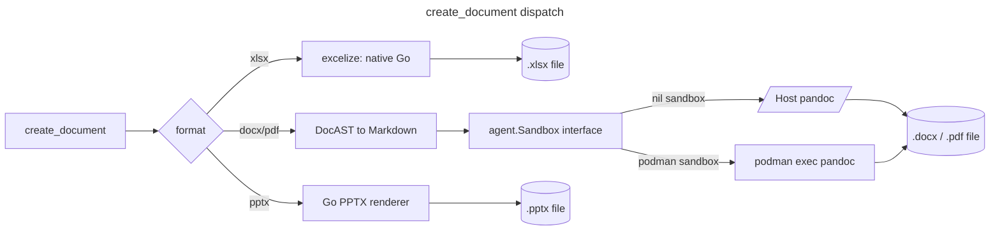

# Document generation (experimental)

`create_document` generates a new `xlsx`, `docx`, `pdf`, or `pptx` file
from structured content — the write-side counterpart to
[`read_document`](tools.md#read_document), which now also reads `.pdf`,
`.xlsx`, `.docx`, and `.pptx` (alongside its original CSV/TSV/JSON/JSONL/
XML/HTML formats). xlsx and pptx generation are native Go paths; docx/pdf
generation and PDF parsing shell out to `pandoc`/`pdftotext`/`pdfinfo`.
Only those subprocess-backed paths route through the same command
[`Sandbox`][sandbox-doc] `run_bash` uses.

[excelize]: https://github.com/xuri/excelize
[sandbox-doc]: sandbox.md

> **Status: experimental.** Enable with `--experimental document_generation`,
> `YOTTACODE_EXPERIMENTAL=document_generation`, or
> `[experimental] document_generation = true` in config.

## Three generation paths



- **xlsx** never touches the sandbox. Content is described as a
  `sheets` array of rows of cells (`value`, `formula`, `bold`, `italic`,
  `number_format`) and rendered directly to xlsx bytes by excelize, which
  has its own formula-calculation engine — no external tools, works
  identically with or without a command sandbox configured.
- **docx/pdf** content is described as a `blocks` array (`heading`,
  `paragraph`, `list`, `table`, `code`), rendered to Pandoc-flavored
  Markdown, then converted by `pandoc` (pdf additionally passes
  `--pdf-engine=weasyprint`).
- **pptx** content is described as a `slides` array (`title`, `bullets`,
  `notes`, `image`, `image_alt`, `layout`) and rendered by native Go into
  a minimal Office Open XML presentation. Like xlsx, this path never
  touches the sandbox and needs no Python runtime. A slide's `image` is
  validated as a read path the same way a docx/pdf image block is; the
  renderer embeds one local PNG/JPEG/GIF image per slide when supplied.


Every docx/pdf subprocess invocation (`pandoc`/`weasyprint`) runs through the
documents sandbox profile when `[sandbox].backend = "podman"`. The agent chooses
that profile automatically from the tool path; users do not switch sandboxes by
hand. When sandboxing is off, the same commands run on the host PATH.


See [`tools.md#create_document`](tools.md#create_document) for the full
argument reference and examples.

## Requirements

| Format | Requires |
|---|---|
| xlsx | Nothing — pure Go |
| docx | `pandoc` on `PATH` (host) or in `[sandbox].documents_image` |
| pdf | `pandoc` **and** `weasyprint` on `PATH` (host) or in `[sandbox].documents_image` |
| pptx | Nothing — pure Go |


If a required subprocess binary for docx/pdf isn't reachable through the
active sandbox, `create_document` returns an error naming exactly where it
looked (`host PATH` or the sandbox's label) instead of failing silently.


## Using the reference `documents` image

[`infra/documents.Containerfile`](../infra/documents.Containerfile) bundles
only the production subprocess dependencies the current code invokes:
`pandoc` for docx/pdf generation and optional rich docx parsing,
`weasyprint` for PDF generation, and `poppler-utils` (`pdftotext`/
`pdfinfo`) for PDF text extraction. xlsx and pptx paths are native Go and
never use this image.


[roadmap-doc]: ../roadmap/document-generation.md

A CI workflow that builds, smoke-tests, and publishes this image exists
(`.github/workflows/documents-image.yml`, manual `workflow_dispatch` plus
a weekly rebuild for CVE patches), but it's **never been run** — nobody
with registry access has triggered it yet, so
`ghcr.io/yottadynamics/yottacode-documents` isn't live. Build it locally
in the meantime:

```sh
podman build -t yottacode-documents -f infra/documents.Containerfile .
```

Then point the document sandbox profile at it and enable both experimental
flags:

```toml
[experimental]
sandbox             = true
document_generation = true

[sandbox]
backend         = "podman"
documents_image = "yottacode-documents"
```

Once the workflow has actually been run at least once, the published tag
works the same way — `documents_image = "ghcr.io/yottadynamics/yottacode-documents:latest"`
— with no other config changes. `run_bash` keeps using `[sandbox].image`.

Everything else about the sandbox — lifecycle, mounts, network policy,
hardening — is unchanged; see [`sandbox.md`](sandbox.md) for the full
picture. `create_document`'s docx/pdf paths and `read_document`'s PDF path
are the document tools routed through that seam besides `run_bash`.

`read_document`'s PDF path (`pdftotext`/`pdfinfo`) follows the same
availability contract as `create_document`'s pandoc path: a missing
binary is an actionable error naming where it was checked (host `PATH` or
the sandbox label), not a silent empty result. An encrypted or
scanned/image-only PDF is reported as a warning instead, since that's
still a valid, actionable result — see
[`tools.md#read_document`](tools.md#read_document) for the full argument
reference.

## Known limitations

- xlsx/docx/pptx parsing (roadmap Phase C) and PDF parsing (Phase B) are
  both done, structural-only: no tables, images, complex formatting, or
  embedded objects — that's pandoc's job, and only wired for generation
  so far, not parsing.
- pptx generation covers title + bullets + speaker notes + one image per
  slide in a fixed native-Go layout — no tables, charts, multiple images
  per slide, custom template themes, or precise image positioning yet.
  `image_alt` is written to the picture description field for consumers
  that surface OOXML alt text.
- No published `yottacode-documents` image yet — the publish workflow
  exists (`.github/workflows/documents-image.yml`) but has never been
  triggered; build the Containerfile locally until someone with registry
  access runs it.
- `create_document` only ever writes local files; there is no URL output
  or cloud storage integration.
- Table cells and free text are Markdown-escaped before reaching pandoc,
  so a table cell can't be used to inject arbitrary Markdown/HTML
  structure. Headings, paragraphs, and list items support inline bold/
  italic formatting via `spans`/`item_spans` (structured runs, not a raw
  markdown string — each span's text still goes through the same escape
  pass); table cells don't have a `spans` equivalent yet, only plain text.
- docx/pdf blocks support one `image` type (local file path + alt text,
  validated as a read path the same way `read_file` validates one) — no
  inline images within a paragraph, no image sizing/positioning control.
  pptx slides support one `image` per slide the same way — no inline
  images within bullet text.
