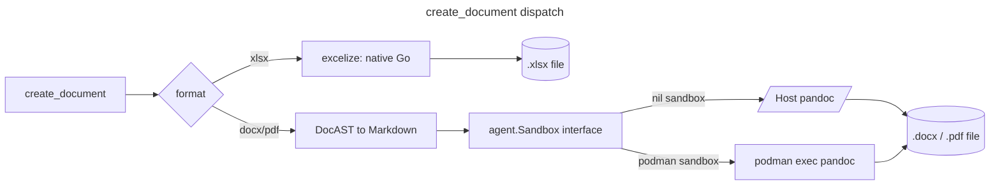

# Document generation (experimental)

`create_document` generates a new `xlsx`, `docx`, or `pdf` file from
structured content — the write-side counterpart to
[`read_document`](tools.md#read_document). xlsx generation is native Go
(via [excelize]); docx/pdf generation shells out to `pandoc`, routed
through the same command [`Sandbox`][sandbox-doc] `run_bash` uses.

[excelize]: https://github.com/xuri/excelize
[sandbox-doc]: sandbox.md

> **Status: experimental.** Enable with `--experimental document_generation`,
> `YOTTACODE_EXPERIMENTAL=document_generation`, or
> `[experimental] document_generation = true` in config.

## Two generation paths



- **xlsx** never touches the sandbox. Content is described as a
  `sheets` array of rows of cells (`value`, `formula`, `bold`, `italic`,
  `number_format`) and rendered directly to xlsx bytes by excelize, which
  has its own formula-calculation engine — no external tools, works
  identically with or without a command sandbox configured.
- **docx/pdf** content is described as a `blocks` array (`heading`,
  `paragraph`, `list`, `table`, `code`), rendered to Pandoc-flavored
  Markdown, then converted by `pandoc` (pdf additionally passes
  `--pdf-engine=weasyprint`). The `pandoc`/`weasyprint` invocation runs
  through whatever [`agent.Sandbox`][sandbox-doc] the session has: directly
  on the host when no sandbox is configured, or via `podman exec` when
  `[sandbox].backend = "podman"` — the exact same seam `run_bash` uses, so
  a malicious input can't reach a native parser/renderer outside the
  container any more than a malicious shell command can.

See [`tools.md#create_document`](tools.md#create_document) for the full
argument reference and examples.

## Requirements

| Format | Requires |
|---|---|
| xlsx | Nothing — pure Go |
| docx | `pandoc` on `PATH` (host) or in `[sandbox].image` |
| pdf | `pandoc` **and** `weasyprint` on `PATH` (host) or in `[sandbox].image` |

If `pandoc` isn't reachable through the active sandbox, `create_document`
returns an error naming exactly where it looked (`host PATH` or the
sandbox's label) instead of failing silently or falling back to a
degraded format.

## Using the reference `documents` image

[`infra/documents.Containerfile`](../infra/documents.Containerfile) bundles
`pandoc`, headless LibreOffice (`writer`/`calc`/`impress`), `poppler-utils`,
and Python document libraries (`pdfplumber`, `pypdf`, `python-docx`,
`python-pptx`, `reportlab`, `weasyprint`) — everything this round's
docx/pdf path needs, plus what later parsing/generation phases (see
[`document-generation.md` in the roadmap][roadmap-doc]) will need without a
rebuild.

[roadmap-doc]: ../roadmap/document-generation.md

It is **not published to any registry** — build it locally:

```sh
podman build -t yottacode-documents -f infra/documents.Containerfile .
```

Then point the command sandbox at it and enable both experimental flags:

```toml
[experimental]
sandbox             = true
document_generation = true

[sandbox]
backend = "podman"
image   = "yottacode-documents"
```

Everything else about the sandbox — lifecycle, mounts, network policy,
hardening — is unchanged; see [`sandbox.md`](sandbox.md) for the full
picture. `create_document`'s docx/pdf path is the second tool routed
through that seam, after `run_bash`.

## Known limitations

- No pptx generation (roadmap Phase 4, Python-first, not built yet).
- No PDF/docx/xlsx/pptx *parsing* beyond what `read_document` already
  covers (roadmap Phase B/C, not built yet).
- No published `yottacode-documents` image — build the Containerfile
  locally.
- `create_document` only ever writes local files; there is no URL output
  or cloud storage integration.
- Table cells and free text are Markdown-escaped before reaching pandoc,
  so a table cell can't be used to inject arbitrary Markdown/HTML
  structure — but there is no inline-formatting support (bold/italic
  spans inside a paragraph) yet, only block-level structure.
