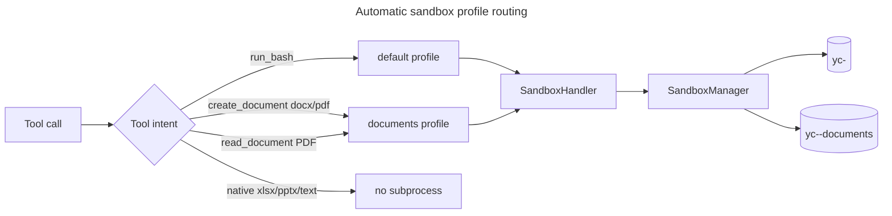

# Automatic sandbox profile routing — implementation plan

## Context

`run_bash`, `create_document`, and `read_document` share the same command-execution seam. The old sandbox model created one Podman container at session startup from `[sandbox].image`, so document subprocess paths (`pandoc`, `weasyprint`, `pdftotext`, `pdfinfo`) failed when the session started with the default UBI image. The desired fix is not user-facing `/sandbox documents` switching. The agent/tooling should infer the required container from the tool path.

## Direction

Use a session-owned `SandboxManager` that lazily creates and reuses one container per tool-selected profile:

- `default` — general command sandbox for `run_bash`, using `[sandbox].image`.
- `documents` — document helper sandbox for subprocess-backed document paths, using `[sandbox].documents_image`.
- no sandbox — only when sandboxing is explicitly disabled (`backend = "none"` or the sandbox experiment is off), preserving host execution.

There is no active profile state, no live user profile switch, and no tool-registry rebuild. The stable `SandboxHandler` remains injected into tools for the whole session; profile-aware tools call the optional `ProfiledSandbox` interface when they need a non-default profile.

## Architecture



## Safety invariants

- If sandboxing is enabled and the required profile cannot be created or used, fail closed with an actionable sandbox error.
- Never fall back to host execution when sandboxing is enabled.
- If sandboxing is explicitly off, host execution is allowed and host dependencies are the user's responsibility.
- Keep model/tool schema/cache state stable; do not rebuild the runtime or registry to change command execution.
- Worktree switching remains constrained while managed containers are live because containers are mounted at the original cwd.

## Implementation slices

1. Add `SandboxProfile` / `ProfiledSandbox` in `internal/agent/sandbox.go`.
2. Add `SandboxManager` + stable `SandboxHandler` in `internal/agentruntime/sandbox_manager.go`.
3. Wire runtime to inject the handler and close the manager-owned containers on teardown.
4. Add config support for `[sandbox].documents_image`, defaulting to `ghcr.io/yottadynamics/yottacode-documents:latest`.
5. Route `create_document` docx/pdf and `read_document` PDF subprocesses through the documents profile; keep `run_bash` on default.
6. Keep dispatch write workers on their own lazy manager mounted at the worker worktree; read-only workers reuse the parent registry/manager.
7. Update docs to describe automatic routing instead of user-selected profile switching.
8. Verify with focused tests, then full `go test ./...` and `go vet ./...`.

## Verification targets

```bash
go test ./internal/agent ./internal/agentruntime ./internal/config
go test ./...
go vet ./...
```

Manual smoke with Podman available:

1. Start with sandbox enabled and default image configured.
2. Run `run_bash`; confirm `[podman:default]` label and default image use.
3. Generate/read a subprocess-backed document; confirm `[podman:documents]` label and documents image use.
4. Configure a bogus `documents_image`; confirm document tools fail closed and host is not used.
