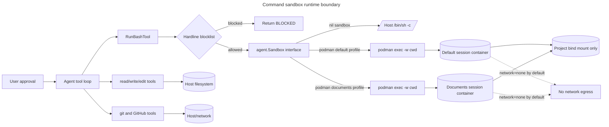
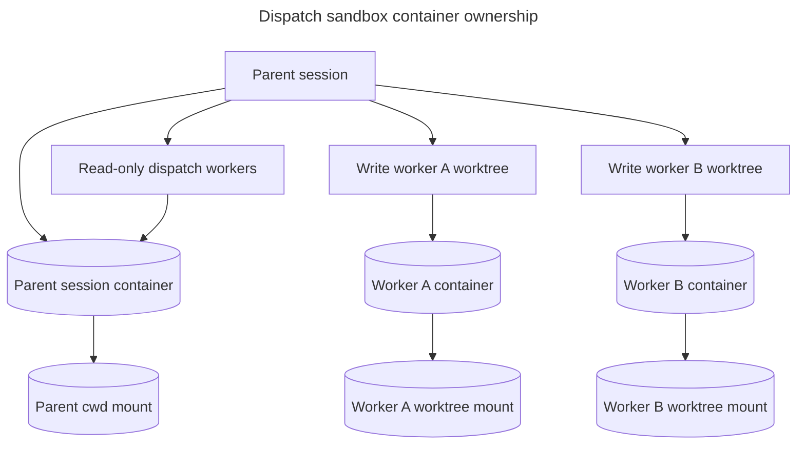

# Command sandbox (experimental)

`run_bash` normally executes directly on the host: the only guardrails are
approval and the hardline blocklist in `internal/agent/exec_tool.go`. The
command sandbox adds a real isolation boundary underneath that: approved
`run_bash` commands execute inside a rootless [Podman] container with a
default-deny network and a filesystem that only sees the project tree.

yottacode itself still runs on the host. File tools, git tools, GitHub tools,
MCP tools, the TUI, and provider traffic are not inside the container.

[Podman]: https://podman.io/

> **Status: experimental.** Enable with `--experimental sandbox`,
> `YOTTACODE_EXPERIMENTAL=sandbox`, or `[experimental] sandbox = true` in
> config, **and** set `[sandbox] backend = "podman"`. The flag alone does not
> turn it on. Requires `podman` installed and on `PATH`.

## Architecture



Legend: solid arrows are execution or filesystem access paths; dotted arrows
are denied-by-default capabilities. The boundary is the `agent.Sandbox`
interface in `internal/agent/sandbox.go`; the concrete Podman lifecycle lives in
`internal/sandbox/podman.go` so the core agent package does not import Podman.



Write workers get their own lazy sandbox manager because their worktrees are different
absolute paths than the parent session's mounted cwd. Read-only workers reuse
the parent registry and therefore the parent sandbox manager; their concurrent
commands share those profile containers' `memory`/`cpus`/`pids_limit` budget.

## Implementation map

| Area | Files | Responsibility |
|---|---|---|
| Sandbox seam | `internal/agent/sandbox.go`, `internal/agent/exec_tool.go` | Defines `Sandbox` and optional `ProfiledSandbox`, keeps nil as host execution, labels sandboxed commands, and annotates Podman infrastructure exit code 125. |
| Podman lifecycle | `internal/sandbox/podman.go`, `internal/sandbox/detect.go` | Starts one rootless container for a requested manager profile, builds `podman exec`, validates mounts, detects local Podman/image state, and tears containers down. |
| Session wiring | `internal/agentruntime/runtime.go`, `internal/agentruntime/sandbox_manager.go` | Creates a lazy per-profile sandbox manager only when the experimental flag is enabled and `[sandbox].backend = "podman"`; never falls back to host execution on profile creation failure. |
| Dispatch inheritance | `internal/agent/dispatch_tool.go` | Gives each write worker a worker-scoped sandbox mounted at that worker's worktree; read-only workers reuse the parent registry. |
| Worktree guard | `internal/agent/enter_worktree_tool.go` | Refuses mid-session worktree swaps once a lazy sandbox profile has created a live container, because that container cannot be remounted. |
| TUI control | `internal/tui/sandbox_picker.go`, `internal/tui/cmd_sandbox.go` | Persists sandbox mode, toggles live auto mode when requested, probes Podman/image availability, and tells users a restart/new session is required for backend changes. |
| Config/docs | `internal/config/config.go`, `docs/sandbox.md` | Owns defaults, validation, and user-facing contract. |

## Startup and command flow

1. Config loads onto defaults, then `config.Validate` rejects invalid sandbox
   backends, networks, missing Podman resource limits, and zero CPU/PID limits
   when `backend = "podman"`.
2. The TUI or oneshot entry point checks both gates: experimental `sandbox` is
   enabled and `[sandbox].backend = "podman"`.
3. `RegisterCoreCwdTools` injects a stable sandbox handler into command-capable
   tools. A nil value keeps the previous host behavior.
4. Each tool chooses its profile from intent: `run_bash` uses `default`, while
   `create_document` docx/pdf and `read_document` PDF subprocess paths use
   `documents`. Native document paths do not shell out.
5. On first use of a profile, `SandboxManager` calls `sandbox.NewPodmanSandbox`,
   using the latest `config.toml` for profiles that are not live yet. That lets
   a user fix `[sandbox].documents_image` and retry a document tool without
   rebuilding the whole tool registry. The manager validates the mount root,
   removes any leftover container with the deterministic profile name, starts
   `podman run -d ... sleep infinity`, and returns an `agent.Sandbox`
   implementation.
6. Each `run_bash` call still checks the hardline blocklist before the sandbox
   sees the command. Allowed commands run through `Sandbox.Command` with the
   current cwd.
7. On cancellation, `PodmanSandbox.Command` best-effort kills the marked process
   inside the container before killing the local `podman exec` client. Session
   teardown closes the manager, which removes every live profile container.

## `/sandbox`

The fastest way to change the setting is `/sandbox` in the TUI. It opens a
three-row picker:

```text
❯ ✓ Sandbox run_bash, with auto-allow
    Sandbox run_bash, with regular permissions
    No sandbox
```

- **Sandbox, with auto-allow** — when the sandbox experiment is already active,
  persists `[sandbox].backend = "podman"` and turns on this session's live auto
  mode for edits. `run_bash`, `git_commit`, `git_checkpoint`, and `rollback`
  still prompt because they stay in auto mode's safety floor.
- **Sandbox, with regular permissions** — when the sandbox experiment is already
  active, persists the same podman backend and leaves live auto mode untouched.
- **No sandbox** — persists `backend = "none"`, today's default; if this picker
  previously enabled auto-allow, it also turns that live auto mode back off.

The picker shows separate configured/live state (`Configured: sandbox on/off` and
`Active: sandbox on/off`). If config already says Podman but the current session
was started before the sandbox container existed, it renders `Active: sandbox off
— restart required`; sandbox rows are marked for the next session and cannot be
selected again until yottacode is restarted. This prevents a config-only change
from looking like live isolation.

The backend selection does **not** hot-swap the running session. The tool
registry gets its `Sandbox` once during session startup, and the Podman
container is created with that session's cwd mounted. Restart yottacode or start
a new session for backend changes to affect command execution. Enter (or the
`[A] Apply selection` action) writes config and always says restart/new session
is required so users do not mistake a config write for a live isolation change.

The picker also runs a local, network-free detection pass (`podman image exists
<image>`) for both `[sandbox].image` and `[sandbox].documents_image`. It shows a
hard warning if Podman is missing. Missing images are non-fatal because Podman
can pull them on first use; if the pull/start fails, the tool fails closed with
the Podman error instead of falling back to the host.

## Config
```toml
[experimental]
sandbox = true

[sandbox]
backend         = "podman"      # "none" (default) | "podman"
image           = "registry.access.redhat.com/ubi9/ubi:9.8-1785906690"
documents_image = "ghcr.io/yottadynamics/yottacode-documents:latest"
network         = "none"        # "none" (default) | "host"
mounts          = ["."]         # project-relative only; cannot escape root
env_passthrough = []            # opt-in credential injection, e.g. ["GITHUB_TOKEN"]
memory          = "2g"
cpus            = 2
pids_limit      = 256
```

When `backend = "podman"`, `image`, `documents_image`, `memory`, positive `cpus`, and positive
`pids_limit` are required. This prevents Podman from receiving empty or zero
resource-limit flags. `image` is the default profile used by `run_bash`;
`documents_image` is the profile automatically used by document subprocess tools.

Unused profiles reload this block before their first container starts, so fixing
`documents_image` mid-session is enough for the next document-tool attempt. A
backend change (`podman` ↔ `none`) still needs a new session.

## What's isolated, and what isn't

- **One container per used profile per session**, not per command — `podman run -d ... sleep
  infinity` on first profile use, `podman exec` for every sandboxed command,
  and `podman rm -f` on session end. A fresh container per command would forget
  installed packages and background state between commands.
- **Filesystem**: the project root is mounted at the same absolute path inside
  the container as on the host. Optional `mounts` entries are project-relative
  subpaths; absolute paths and `..` escapes are rejected so config cannot widen
  the container's filesystem view outside the project root. Host-side file tools
  still edit the same tree directly.
- **Network**: `--network=none` by default. There is no allowlist mode yet; it
  is all-or-nothing via `network = "host"`.
- **Credentials**: nothing is injected by default. `env_passthrough` forwards
  named variables with bare `-e NAME`, so values do not appear in Podman's argv.
- **Hardening**: the container uses `--userns=keep-id`, `--cap-drop=ALL`,
  `--security-opt=no-new-privileges`, private cgroups, no swap beyond the memory
  limit, a `noexec,nosuid,nodev` `/tmp`, SELinux `:Z` bind labels, and configured
  `pids_limit`/`memory`/`cpus` caps.
- **`run_bash`, `run_tests`, `create_document`'s docx/pdf paths, and
  `read_document`'s PDF path are sandboxed.** Git, GitHub, MCP, provider
  calls, and the other file tools still run on the host. The hardline
  blocklist stays outside the sandbox because a blocked command can still
  destroy the mounted project tree. See [`document-generation.md`](document-generation.md)
  for how the document tools route their `pandoc`/`pdftotext` calls
  through the documents profile while `run_bash` and `run_tests` stay on the default profile.

## Dispatch interaction

When [dispatch](dispatch.md) write-workers run, each gets its **own** lazy
sandbox manager mounted at its own worktree whenever the parent session has
podman sandboxing on. Read-only dispatch workers do not get separate managers;
they share the parent tool registry and parent sandbox manager.

This is also what unlocks unattended `run_bash`/`run_tests` for **background**
(unattended) dispatch write workers: those calls are denied outright when the
worker runs on the host (see [dispatch.md](dispatch.md#approvals)), and
allowed once the worker's own container bounds their blast radius.

This means concurrent read-only workers' sandboxed commands and the parent
session's own sandboxed commands all execute inside the same per-profile
containers. Size `[sandbox]` resource limits with that in mind if read-only
workers run tests or linters concurrently.

## Worktree interaction

`enter_worktree` is blocked only after a lazy sandbox profile has created a
live container. That container was created with the original cwd mounted; after
a mid-session cwd swap, `podman exec -w <new-worktree>` would point at a path
the container cannot see. A freshly-started sandbox-enabled session that has not
run `run_bash` or a subprocess-backed document path yet has no live container,
so it can still enter a worktree safely. Once a profile is live, start yottacode
directly inside the worktree (`yottacode --worktree <name>`) or restart without
sandbox before entering a worktree.

Changing an image for a profile that is already live also needs a new session:
the running container keeps the image it started with. The live-reload behavior
only applies to profiles that have not created a container yet.

## Known limitations

- No network allowlist — `network = "none"` or `network = "host"` only.
- No credential-stripping egress proxy.
- No published `yottacode/sandbox` base image yet — bring your own via
  `[sandbox].image`.
- Not tested on macOS Podman machine latency; Linux rootless Podman is the
  supported path today.
